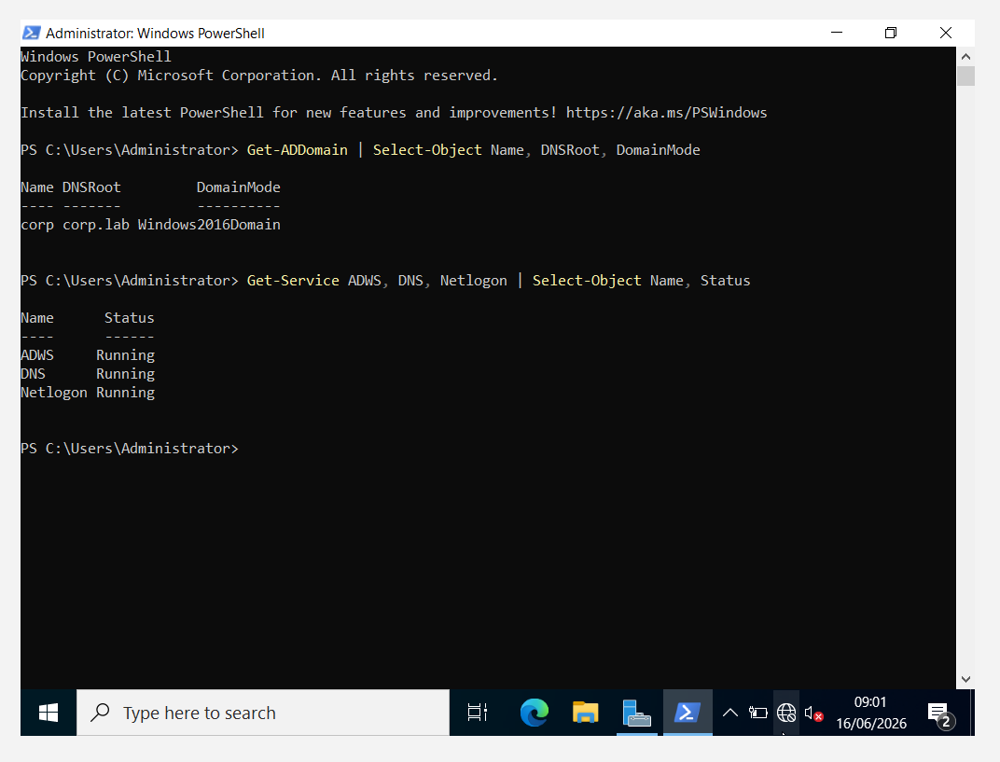
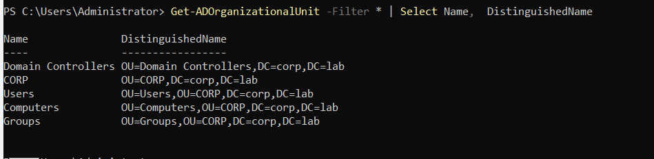
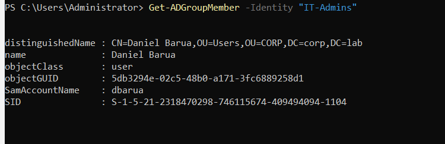
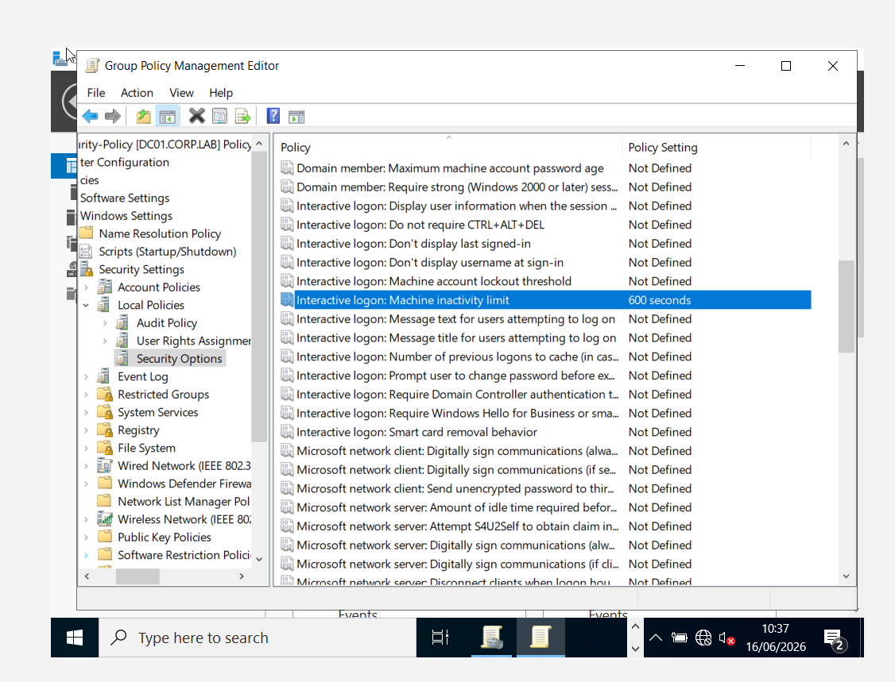
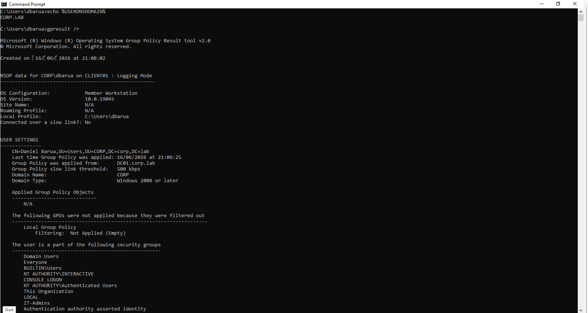
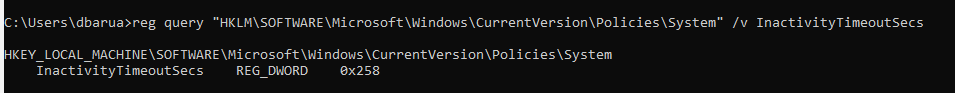
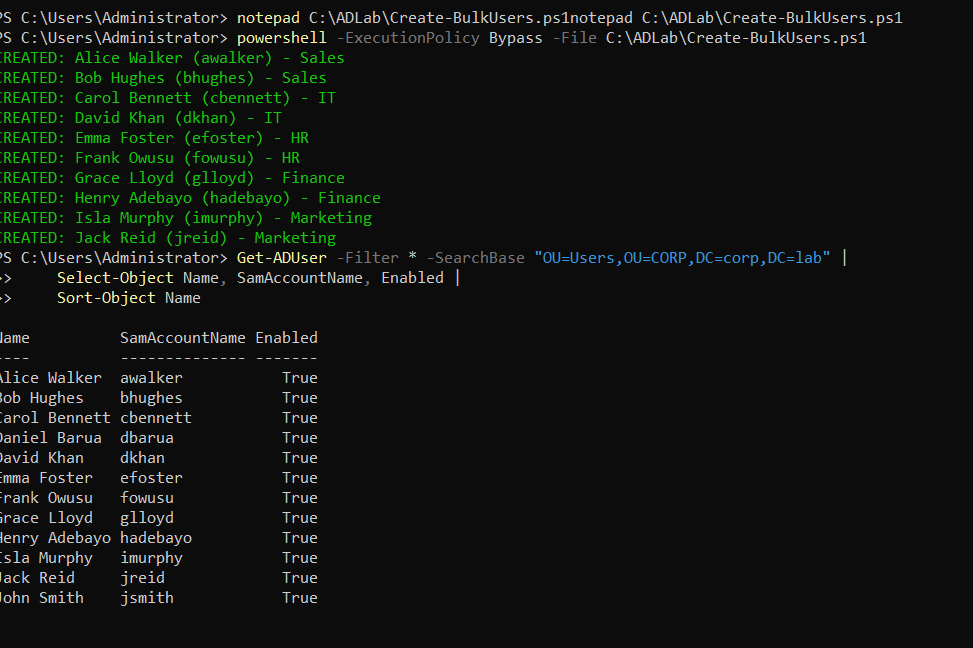

# Active Directory Domain Lab (Windows Server 2022)

A hands-on home lab where I built a fully functional **Active Directory** domain from scratch in VirtualBox: a Windows Server 2022 Domain Controller, organizational structure, Group Policy, a domain-joined Windows 10 client, and **PowerShell-automated bulk user provisioning**.

Built as part of my MSc in Applied Cyber Security to develop practical **Identity & Access Management (IAM)** and Windows administration skills, and to serve as a log source for follow-on **SIEM (Splunk/Wazuh)** monitoring labs.

---

## 🎯 Objectives

- Stand up a new Active Directory forest and domain (`corp.lab`) on Windows Server 2022.
- Design a clean Organizational Unit (OU) structure with users and security groups.
- Create and apply a **Group Policy Object (GPO)** to enforce a security control.
- Join a Windows 10 client to the domain and authenticate as a domain user.
- **Automate bulk user creation** from a CSV using PowerShell.
- Document the build and the underlying concepts clearly.

---

## 🗺️ Architecture

| Role | Hostname | OS | IP Address | Notes |
|------|----------|----|------------|-------|
| Domain Controller / DNS | `DC01` | Windows Server 2022 | `10.10.10.10/24` | Forest root, DNS server |
| Client workstation | `CLIENT01` | Windows 10 | `10.10.10.20/24` | Domain-joined member |

- **Forest / Domain:** `corp.lab`
- **Network:** VirtualBox Internal Network `lab-net` (isolated, no gateway)
- **DNS:** DC01 points to itself (`127.0.0.1`); the client points to DC01 (`10.10.10.10`)

```
corp.lab
├── Domain Controllers
│     └── DC01
└── CORP (OU)
      ├── Users      → dbarua, jsmith + 10 bulk-created staff
      ├── Computers  → CLIENT01
      └── Groups     → IT-Admins
```

---

## 🛠️ Skills Demonstrated

- Windows Server 2022 installation & configuration
- Static IP / DNS configuration for a Domain Controller
- Installing **AD DS** and promoting a server to a Domain Controller (`Install-ADDSForest`)
- Designing OUs, users, and security groups
- Creating, linking, and verifying **Group Policy Objects**
- Joining a Windows client to a domain and validating authentication
- **PowerShell automation** — bulk user provisioning from CSV (idempotent script)
- Troubleshooting real AD issues (network connectivity, GPO scope, OU placement)

---

## 🔧 Build Walkthrough

### 1–2. Server VM & OS install
Created the DC01 VM (4 GB RAM, 2 vCPU, 60 GB) on an isolated Internal Network, and installed Windows Server 2022 Standard (Desktop Experience).

### 3. Network & hostname
Configured a static IP `10.10.10.10/24`, set DNS to `127.0.0.1` (loopback — the DC is its own DNS server), and renamed the machine to `DC01`.

### 4. Promote to Domain Controller
```powershell
Install-WindowsFeature AD-Domain-Services -IncludeManagementTools
Install-ADDSForest -DomainName "corp.lab" -InstallDNS
```
Verified with `Get-ADDomain` and confirmed `ADWS`, `DNS`, and `Netlogon` services running.



### 5. OUs, users, and groups
Built the `CORP` OU tree (Users / Computers / Groups), an `IT-Admins` security group, and the first domain users — all via PowerShell (`New-ADOrganizationalUnit`, `New-ADGroup`, `New-ADUser`).




### 6. Group Policy
Created **`CORP-Security-Policy`**, linked it to the `CORP` OU, and configured *Interactive logon: Machine inactivity limit = 600 seconds* (auto screen-lock after 10 minutes).



### 7. Join the Windows 10 client
Set the client's static IP (`10.10.10.20`) and DNS (`10.10.10.10`), then joined it to `corp.lab` and renamed it `CLIENT01`.

### 8. Verify domain login + GPO
Logged in as `CORP\dbarua` and verified policy delivery:
```cmd
whoami                                   :: corp\dbarua
gpresult /r                              :: Group Policy applied from DC01.corp.lab
reg query "HKLM\SOFTWARE\Microsoft\Windows\CurrentVersion\Policies\System" /v InactivityTimeoutSecs
:: InactivityTimeoutSecs  REG_DWORD  0x258   (= 600 seconds ✔)
```




### 9. Bulk user provisioning (PowerShell + CSV)
Created 10 users from a CSV with one reusable, **idempotent** script — see [`scripts/Create-BulkUsers.ps1`](scripts/Create-BulkUsers.ps1).
```powershell
powershell -ExecutionPolicy Bypass -File C:\ADLab\Create-BulkUsers.ps1
```



---

## 🧩 Troubleshooting Notes (real issues I solved)

- **Client couldn't reach the DC (`ping` → "host unreachable").** The cloned client VM's adapter was on VirtualBox's default Internal Network name `intnet` instead of `lab-net`. Renaming it to match fixed Layer-2 connectivity.
- **Computer GPO wasn't applying.** A newly domain-joined PC lands in the default `CN=Computers` container, which is *outside* the `CORP` OU the GPO is linked to. Moving the computer object into `OU=Computers,OU=CORP` with `Move-ADObject` resolved it — a reminder that **GPOs only apply based on where the object lives in the OU tree**, and that GPOs can't be linked to default containers.

---

## 📚 Key Concepts Covered

- **Domain Controller** — central authority for authentication, the directory database, and policy.
- **DNS in AD** — clients locate domain controllers via DNS SRV records; all members point DNS at the DC.
- **Kerberos** — ticket-based authentication so passwords are never sent to services; enables single sign-on.
- **Forest / Domain / OU** — the security boundary, the administrative unit, and the containers used to organize objects and target Group Policy.

---

## 🚀 Next Steps

- Forward Windows Security/Sysmon logs from this domain into **Splunk / Wazuh** for SOC-style monitoring.
- Simulate and detect common AD attacks (e.g. failed-logon brute force, Kerberoasting).

---

*Built by Daniel Barua — MSc Applied Cyber Security.*
